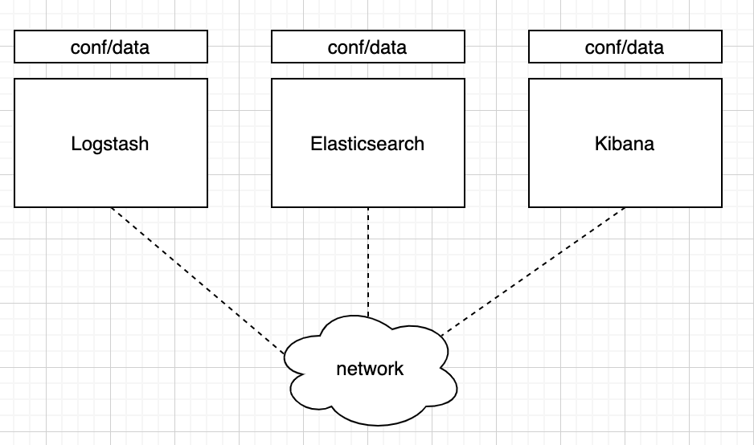
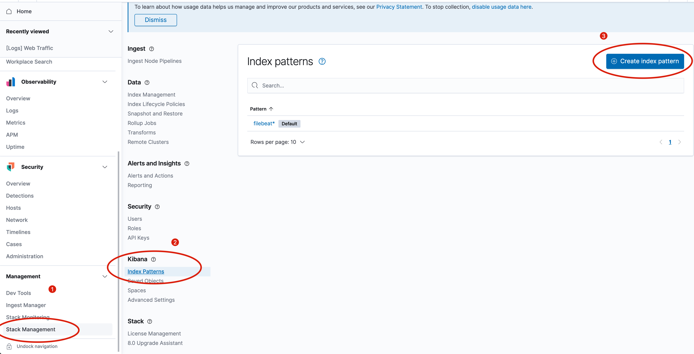
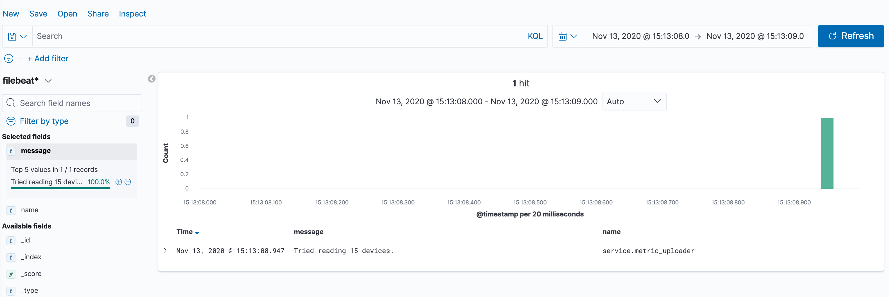

# ELKStackDockerConfig

[TOC]

## 背景介绍

ELK是三个开源项目的缩写，Elasticsearch 是一个搜索和分析引擎。Logstash 是服务器端数据处理管道，能够同时从多个来源采集数据，转换数据，然后将数据发送到诸如 Elasticsearch 等“存储库”中。Kibana 则可以让用户在 Elasticsearch 中使用图形和图表对数据进行可视化。

ELK框架可以用来解决很多搜索类的问题，其中一个比较流行的应用就是对日志的存储和分析。通过部署ELK服务，可以从多个源采集日志信息到服务器，进行统一存储和分析，再配合可视化图表，可以清楚的展示出系统信息，便于维护人员及时定位潜在问题。本项目在Docker环境下搭建了ELK服务，在此对整体流程进行简单介绍。


上图是使用ELK框架时常用的架构方式。在每台需要监听的主机上安装Filebeat程序，用来监听Source的日志信息，Filebeat也是ELK框架中的一个技术，是一个轻量级的日志收集工具。这里的Source可以配置成多种来源，比如可以直接从文本文件中读取、从UDP/TCP中读取。更多的方式可以参考[官网说明](https://www.elastic.co/guide/en/beats/filebeat/7.9/configuration-filebeat-options.html)。

Filebeat将数据发送到Logstash中进行处理，比如在这里可以提取和过滤字段。从Filebeat传递到Logstash中的数据是一个JSON字符串，日志的原始信息被封装在`message`字段中，需要根据具体的日志字段信息来配置解析的方式。除了message字段外，从Filebeat中传递到Logstash中的信息还包含一个额外的metadata比如timestamp。

在Logstash对信息进行预处理之后，就可以将其发送到Elasticsearch服务器中进行index。在Elasticsearch，index类似于数据库，一般而言需要为这个index指定一个有意义的名字，比如`articles`，那么以后获取文章就可以用`GET /articles/id`方式来获取，其中id一般是Elasticsearch为每条记录自动生成的唯一标识，也可以自己指定。

可以将Elasticsearch看成一个数据库，在存储了数据后，Kibana从中拉取数据进行展示。

以上就是使用ELK框架搭建日志分析系统的简单框架，后文将详细说明每一步所需要的配置。如果你刚好有类似的需求，可以参考本项目的配置。elasticsearch目录中包含了Elasticsearch镜像的构建文件以及配置方法，Kibana文件夹中包含了Kibana的镜像构建文件和配置方法，logstash文件夹中则包含了Logstash的构建文件和配置方法；`.env`规定了环境变量，`docker-compose.yml`是compose文件，可以看成整个程序的人口。

## 开发环境

macOS Catalina 10.15.6

VM: Ubuntu 20.04

Docker version 19.03.13

docker-compose version 1.27.4

## Filebeat配置与安装

如上文所述，Filebeat是一个轻量级的日志收集工具，通常它单独运行在目标主机上进行日志收集。比如在一个物联网系统中，有大量的边缘计算服务器，则需要在每台需要监测的设备上安装Filebeat来收集日志。如果仅有这样的需求，似乎并不需要采用docker的方式来部署，所以这里也没采用docker方式来配置，只是简单地run这个进程。

安装：

使用curl方式进行安装，下载Filebeat的安装包，解压到所需的目录即可：

```
curl -L -O https://artifacts.elastic.co/downloads/beats/filebeat/filebeat-7.10.0-linux-x86_64.tar.gz
tar xzvf filebeat-7.10.0-linux-x86_64.tar.gz
```

进入Filebeat安装目录，修改配置文件`filebeat.yml`，在这里可以修改Filebeat接收输入的方式，以及向哪里输出。在这里，本项目设置Filebeat从UDP8888端口接收数据，输出到Logstash监听的5044端口，修改后的配置文件如下：

```
filebeat.inputs:
- type: udp
  enabled: true
  max_message_size: 10KiB
  host: "localhost:8888"

#----------------------------- Logstash output --------------------------------
output.logstash:
     hosts: ["127.0.0.1:5044"]

```

从UDP接收数据是一种比较简单的方式，为了减轻对磁盘的读写次数，你可以将程序生成的日志直接通过UDP发送到FIlebeat进行采集；此外，在本机进行测试时，也可以方便的使用`nc`等网络工具来发送UDP包进行测试。

运行Filebeat也很简单，直接使用`filebeat`命令运行即可；

## 安装Docker

Docker是一种虚拟化/容器化技术，使用它可以简化应用程序的部署。Docker将应用程序封装成镜像，而运行镜像就得到了容器，下图是对Docker的简单说明。



使用了Docker后，应用程序从Image中创建container，Image和container的关系类似于程序和进程之间的关系。由于Image是“死”的，有时候我们需要单独为其加载数据或配置文件，Docker也提供了这样一种方式。我们只要在将本机的配置文件映射到对应的容器中即可。

不同的容器之间，环境、文件系统是互相隔离的，这就避免了容器之间的相互冲突。在这种隔离机制下，Docker提供了容器间的通信。在Docker中，每个容器都被分配一个IP地址，在同一个docker engine中的容器默认都接到bridge网络，顾名思义这些容器之间是桥接的，也就是它们之间可以互相通信。

```yml
services:
  elasticsearch:
    ...
    networks:
      - elk

  logstash:
  	...
    networks:
      - elk

  kibana:
  	...
    networks:
      - elk

networks:
  elk:
    driver: bridge
```

比如在这个配置中，三个服务都指定了网络为elk，所以它们之间是可以通信的；

在使用Docker时，如果我们有很多应用，可以分别使用`docker run`命令来运行容器，比如`docker run redis`命令运行了一个redis服务，但是更方便的方式是使用docker-compose方法。docker-compose允许将所有的配置写到一个统一的文件中，包括Image构建信息、端口映射情况、网络分配等信息，这样我们只要使用简单的`docker compose up`命令就可以一键运行整个应用。

compose文件是一个yml文件，目前为止有三个主要的版本，每个版本支持的配置是不同的，在使用时需要在开头处指定使用的版本。每个版本的具体内容可以参考[这里](https://docs.docker.com/compose/compose-file/compose-versioning/)。

**Docker的安装**

用阿里云镜像安装docker：

```
curl -fsSL https://get.docker.com | bash -s docker --mirror Aliyun
```

为了使用docker-compose命令进行打包运行，需要下载该命令脚本：

```
sudo curl -L "https://github.com/docker/compose/releases/download/1.27.4/docker-compose-$(uname -s)-$(uname -m)" -o /usr/local/bin/docker-compose
```

然后为此脚本添加执行权限：

```
sudo chmod +x /usr/local/bin/docker-compose
```

## 配置ELK

### Logstash配置

在Logstash中，我们主要在`logstash.conf`中配置输入，过滤器和输出。输入规定了Logstash从哪里接受数据，过滤器定义了如何处理这些数据，比如字段的映射，输出规定了处理完的数据的流出方向。

在这里我们设置Logstash从filebeat中接受数据，输出到Elasticsearch中；过滤器是将从filebeat中接收到的数据进行映射，处理成json格式发送给输出，从filebeat中接受的数默认放在message域中，这里的映射是`"message" => "..."`，可以同时有多个输出，为了方便展示，这里也将处理过的数据输出到控制台。

```
input {
	beats {
		port => 5044
	}
}

filter {
  dissect {
    mapping => { "message" => "[%{ts} %{+ts}][%{levelname}][%{threadName}][%{name}:%{lineno}] %{message}" }
  }
}

output {
    stdout {
        codec => rubydebug
    }
    elasticsearch {
        hosts => "elasticsearch:9200"
				user => "elastic"
				password => "changeme"
        index => "%{[@metadata][beat]}-%{[@metadata][version]}-%{+YYYY.MM.dd}"
    }
}
```


### Elasticsearch配置

es中主要就是使用自带的X-pack插件进行安全性的配置，这样从Kibana中登录连接到es就需要输入密码；具体的设置在elasticsearch文件夹下；

### Kibana配置

在这个简单的例子中，只要设置一下index pattern即可。index pattern的原理是这样的，对于es的index，很多人习惯用项目名称+日期的方式建立index名称，比如`myproject-2020-11-11/id_01`，在Kibana中设置index pattern就可以将一类index都收集起来，比如我们设置index pattern为`myproject*`,这样每天es产生的index都可以被展示到Kibana中。

登录到Kibana界面进行设置是最简单的方法，如下图所示：



## 本地测试

clone本仓库到本地，在开启docker服务后，使用`docker-compose up`即可运行；

```
git clone ..
cd ..
docker-compose up
```

使用`filebeat`命令开启filebeat服务；

使用nc命令向8888端口发送UDP数据报，使用其他的方式发送UDP也是如此；

```
nc -u localhost 8888
```

对于上面的filter方式，发送如下数据进行测试：

```
[2020-11-11 00:04:00,204][INFO][svc-metric-uploader-svc040][service.metric_uploader:88] This is the message we sent.
```

几乎同时可以在Logstash的终端输出中看到对应的json输出，因为我们之前配置过输出到终端中，然后再打开Kibana的Discover界面，就可以看到数据以及展示在时间序列图中；可供添加的字段在左侧，可以根据需要进行添加；

